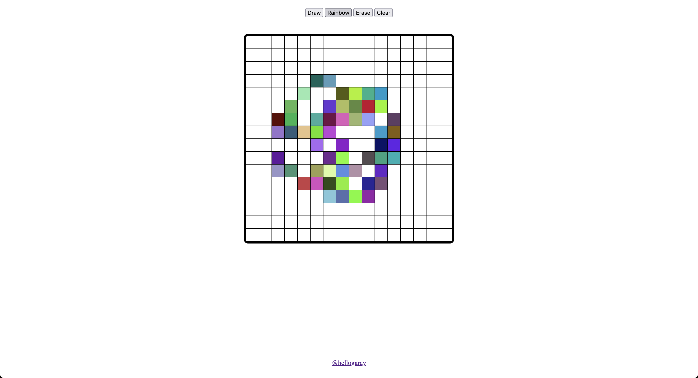
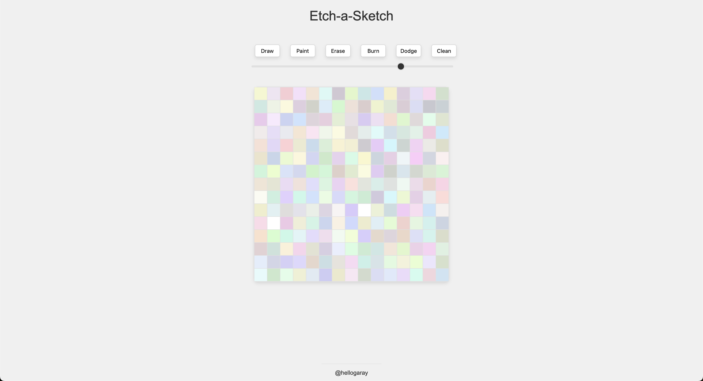

  <h1>Project-Etch-a-Sketch</h1>
  
The Odin Project - Etc-a-Sketch

  

    
    
    
  

  
  
  

Welcome to the Online Etch A Sketch project! This web application recreates the classic Etch A Sketch drawing toy in a digital format, allowing users to draw freely and unleash their creativity.

## Description

Experience the nostalgic joy of doodling on an Etch A Sketch, right from your browser! This project implements the beloved drawing toy using HTML, CSS, and JavaScript, providing an interactive and fun way to create unique artworks.

## Features

- Simulates the Etch A Sketch drawing experience in a digital format.
- Allows users to draw by clicking and dragging the cursor across the grid.
- Clear the screen at any time to start anew.
- Provides an interactive and fun way to unleash creativity.

## Usage

1. Clone or download the repository.
2. Open the `index.html` file in your web browser.
3. Click and drag your mouse cursor across the grid to draw.
4. Release the mouse button to stop drawing.
5. Click the "Clear" button to erase the entire drawing and start fresh.
6. Let your imagination run wild and create anything you desire on the digital Etch A Sketch!

## Original Version

  

## Final Version

  

The images above show the original and final versions of the Rock Paper Scissors game. The original version uses the console to get the inut from the game and the new version has it's own UI to get input and show the results.
